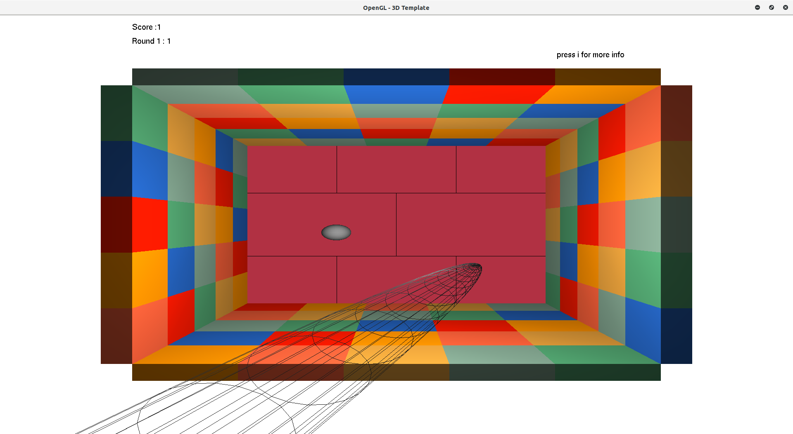
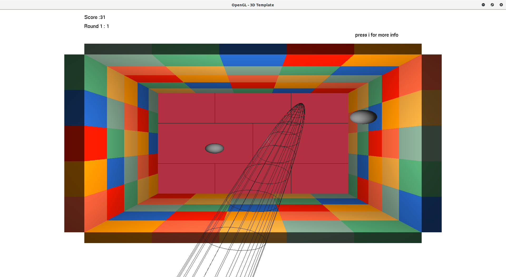

# This Game is developed using openGL 
## to run this on linux :
1)g++ Bouncing_Ball.cpp -o main -lglut -lGLU -lGL

2)./main

# to run on windows you have to configure the path to <glut.h> and better using visual studio for running .  

# The Bouncing ball game : 

### this game is room of different blocks and each block has a specific value 
### you have 3 rounds to get the maximum score .

# Controls :
d -> Right 
w -> Up 
s -> Down 
a -> Left 
Space -> Hit 
i -> info
j -> default mode camera 
k -> simple mode camera 
l -> advanced mode camera 

 
 
